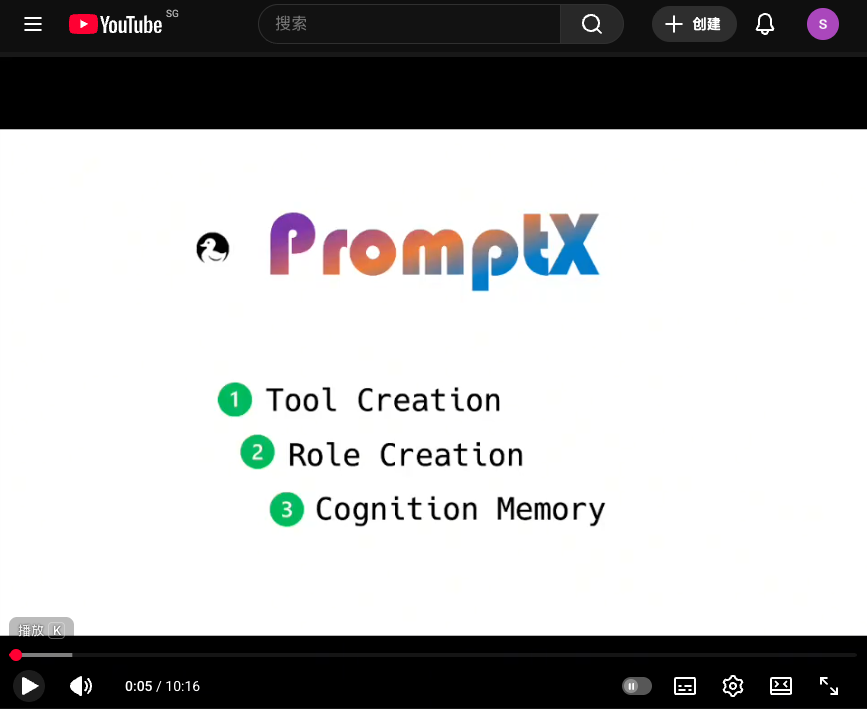

<div align="center">
  
  <h1>PromptX · 領先的AI上下文工程平台</h1>
  <h2>✨ Chat is all you need - 革命性互動設計，讓AI Agent秒變行業專家</h2>
  <p><strong>核心能力：</strong>AI角色創造平台 | 智慧工具開發平台 | 認知記憶系統</p>
  <p>基於MCP協定，一行指令為Claude、Cursor等AI應用注入專業能力</p>

  <!-- Badges -->
  <p>
    <a href=" "></a>
    
    <a href="LICENSE"></a>
    <a href="https://zread.ai/Deepractice/PromptX" target="_blank"></a>
  </p>

  <p>
    <a href="https://www.npmjs.com/package/@promptx/cli"></a>
    <a href="https://github.com/Deepractice/PromptX/releases"></a>
    <a href="https://hub.docker.com/r/deepracticexs/promptx"></a>
  </p>

  <p>
    <a href="README.zh-Hans.md">简体中文</a> | 
    <strong><a href="README.zh-Hant.md">繁體中文</a></strong> | 
    <a href="README.md">English</a> | 
    <a href="https://github.com/Deepractice/PromptX/issues">Issues</a>
  </p>
</div>

---

## 💬 Chat is All you Need - 自然對話，瞬間專業

### ✨ 三步體驗 PromptX 魔力

#### 🔍 **第一步：發現專家**
```
使用者：「我要看看有哪些專家可以用」
AI：    立即展示23個可用角色，從產品經理到架構師應有盡有
```

#### ⚡ **第二步：召喚專家**  
```
使用者：「我需要一個產品經理專家」
AI：    瞬間變身專業產品經理，獲得完整專業知識和工作方法
```

#### 🎯 **第三步：專業對話**
```
使用者：「幫我重新設計產品頁面」
AI：    以專業產品經理身份，提供深度產品策略建議
```

### 🎬 觀看 PromptX 實戰演示

<div align="center">

[](https://www.youtube.com/watch?v=R6ENaj9i0oE)

*點擊觀看：了解 PromptX 如何透過記憶、角色和智慧工具改變 AI 互動*

</div>

### 🚀 為什麼這是革命性的？

**❌ 傳統方式：**
- 學習複雜指令語法
- 記住各種參數配置
- 擔心說錯話導致失效

**✅ PromptX方式：**
- 像和真人專家聊天一樣自然
- 想怎麼說就怎麼說，AI理解你的意圖
- 專家狀態持續對話期間保持有效

### 💡 核心理念

> **把AI當人，不是軟體**
> 
> 不需要「正確指令」，只需要自然表達。AI會理解你想要什麼專家，並瞬間轉換身份。

---

## ⚡ 立即開始 - 三種方式任選

### 🎯 方式一：PromptX 客戶端（推薦）
**適合所有使用者 - 一鍵啟動，零配置**

1. **[下載客戶端](https://github.com/Deepractice/PromptX/releases/latest)** - 支援 Windows、Mac、Linux
2. **啟動HTTP服務** - 打開客戶端，自動運行MCP伺服器
3. **配置AI應用** - 將以下配置添加到你的Claude/Cursor等AI工具：
   ```json
   {
     "mcpServers": {
       "promptx": {
         "type": "streamable-http",
         "url": "http://127.0.0.1:5203/mcp"
       }
     }
   }
   ```

4. **開始對話** - 在AI應用中說「我要看看有哪些專家」

✅ 無需技術背景 ✅ 視覺化管理 ✅ 自動更新

### 🔧 方式二：直接運行（開發者）
**有Node.js環境的開發者可以直接使用：**

```json
{
  "mcpServers": {
    "promptx": {
      "command": "npx",
      "args": ["-y", "@promptx/mcp-server"]
    }
  }
}
```

### 🐳 方式三：Docker（生產就緒）
**使用Docker部署PromptX到生產環境：**

```bash
docker run -d -p 5203:5203 -v ~/.promptx:/root/.promptx deepracticexs/promptx:latest
```

📚 **[完整Docker文檔 →](./docker/README.md)**

---

## 🎨 **女媧與魯班 - PromptX創造雙子星**

### 🎭 **女媧 - AI角色設計師**
<div align="center">
  
</div>

**一句話，一個專家。自然語言創造專業AI角色。**

💡 **想試試女媧？** 請說：「激活女媧，我想創建一個既懂代碼又懂產品的AI助手」

<div align="center">

| 💭 **你說** | 🎭 **女媧創造** | ✨ **結果** |
|---|---|---|
| 「我需要一個既懂代碼又懂產品的人」 | 技術產品經理角色，雙重專業能力 | AI瞬間成為TPM，兼具工程與產品思維 |
| 「創建一個Python專家，像耐心的導師一樣教學」 | Python導師角色，內建教學方法論 | AI變身程式教育專家，循序漸進引導學習 |
| 「我想要一個寫作風格像海明威的AI」 | 文學寫作專家，風格分析能力 | AI採用簡潔有力的寫作風格 |

</div>

### 🔧 **魯班 - 工具整合大師**
<div align="center">
  
</div>

**任何API，任何平台。3分鐘從憑證到可用工具。**

💡 **想試試魯班？** 請說：「激活魯班，我想讓AI能夠查詢我們的PostgreSQL資料庫」

<div align="center">

| 💭 **你說** | 🔧 **魯班建構** | ✨ **結果** |
|---|---|---|
| 「連接我們的企業微信」+ webhook地址 | 企微通知工具，支援群組定向 | AI可以發送消息到任何企微群 |
| 「讓AI查詢我們的PostgreSQL」+ 連接串 | 資料庫工具，安全唯讀查詢 | AI執行SQL並分析資料 |
| 「整合OpenAI的API」+ API密鑰 | AI平台工具，模型切換能力 | AI可以串聯多個AI服務 |

</div>

### ✍️ **Writer - 專業文案寫手**

**從概念到內容。掌握真實、引人入勝的寫作藝術。**

💡 **想試試Writer？** 請說：「激活Writer，我需要寫一篇技術部落格但不要AI味」

<div align="center">

| 💭 **你說** | ✍️ **Writer創造** | ✨ **結果** |
|---|---|---|
| 「寫一篇技術部落格介紹新功能」 | 深度技術內容配合使用者故事 | 開發者真正想讀的引人入勝文章 |
| 「我需要行銷文案，但不要AI味」 | 有人格的文案，自帶說服力 | 因為真實感而轉化的內容 |
| 「幫我寫產品發布公告」 | ISSUE範式：對話式獲取細節 | 有血有肉的產品故事，不是冰冷公告 |

</div>

### 🚀 **為什麼這改變一切**

**傳統AI寫作：** 模板化 → 千篇一律 → 讀者一眼識破 → 信任崩塌

**Writer角色：** 真實對話 → 挖掘獨特細節 → 去AI味處理 → 人味十足的內容

**魔力所在：女媧賦予AI知識，魯班賦予AI能力，Writer賦予AI靈魂。**

---

## 🛠️ 內建工具 - 開箱即用的辦公文檔處理

PromptX 內建專業文檔處理工具，讓 AI 成為你的辦公助手。

### 📊 Excel 工具
讓 AI 成為你的數據分析助手和報表生成專家。
- 數據分析與洞察
- 自動化報表生成
- 圖表視覺化
- 數據處理自動化

**[📖 了解更多](./packages/resource/resources/tool/excel-tool/README.zh-CN.md)** | [English](./packages/resource/resources/tool/excel-tool/README.md)

### 📝 Word 工具
讓 AI 成為你的文檔閱讀專家和專業寫作助手。
- 文檔閱讀與分析
- 專業文檔創建
- 批量文本替換
- 格式轉換

**[📖 了解更多](./packages/resource/resources/tool/word-tool/README.zh-CN.md)** | [English](./packages/resource/resources/tool/word-tool/README.md)

### 📄 PDF 閱讀器
讓 AI 成為你的 PDF 閱讀專家，智能緩存加速訪問。
- 分頁閱讀
- 內容分析與提取
- 圖片提取
- 智能緩存快速訪問

**[📖 了解更多](./packages/resource/resources/tool/pdf-reader/README.zh-CN.md)** | [English](./packages/resource/resources/tool/pdf-reader/README.md)

---

<div align="center">

---

## 📄 **學術研究**

PromptX 已提交至 **WWW Companion '26** 會議。

**論文:** *PromptX: A Cognitive Agent Platform with Long-term Memory*

🔗 [閱讀論文](https://research.deepractice.ai) | [PDF 下載](https://research.deepractice.ai/PromptX_WWW26_Paper.pdf)

<details>
<summary>📚 引用 (BibTeX)</summary>

```bibtex
@inproceedings{promptx2026,
  title={PromptX: A Cognitive Agent Platform with Long-term Memory},
  author={Wang, Binhao and Huang, Jianglin and Hu, Xiao and Jiang, Shan and Wang, Maolin and Yang, Ching-ho},
  booktitle={Proceedings of the WWW Companion '26},
  year={2026}
}
```

</details>

---

## ⭐ **Star成長趨勢**

<div align="center">

[](https://star-history.com/#Deepractice/PromptX&Date)

</div>

---

## 💝 **贊助商**

<div align="center">

### [SignPath](https://signpath.io)

Windows 桌面應用程式程式碼簽章由 [SignPath.io](https://signpath.io) 提供，憑證由 [SignPath Foundation](https://signpath.org) 簽發。

</div>

---

## 🏢 **關於我們**

<div align="center">

**由 [Deepractice 深度實踐](https://github.com/Deepractice) 出品**

*讓AI成為你的專業夥伴*

🌐 [官網](https://deepractice.ai) | 🔧 [GitHub](https://github.com/Deepractice) | 📚 [文檔中心](https://docs.deepractice.ai) | 💬 [論壇](https://x.deepractice.ai) | 🚀 [中轉站服務](https://router.deepractice.ai)

### 聯繫創始人


*掃碼添加 Sean（創始人兼CEO）微信*

</div>


</div>